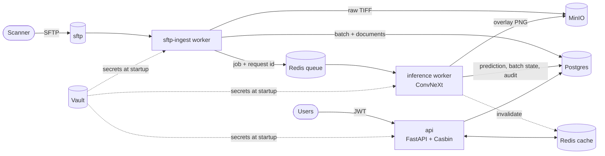

# Document Classifier

[](https://github.com/Bahaamehyeldine/document-classifier/actions/workflows/ci.yml)


An internal document-classification service that runs on a laptop with `docker compose`. A scanner drops page images over **SFTP**; a worker pipeline classifies them by **visual layout** (no OCR) into the 16 RVL-CDIP classes with a fine-tuned **ConvNeXt**; authenticated users review the results through a **permission-gated API**.



> **Status.** The whole service is implemented and tested: auth and roles, SFTP ingestion, inference worker, caching, audit log, Vault secrets, CI with a compose smoke test. What remains is **training the model** on Colab (see [Train the model](#train-the-model)). Until the weights are committed, the api and worker correctly refuse to start, and CI exercises the pipeline up to the queued job.

---

## Features

- **Layered architecture, enforced:** `api → services → repositories → db`. Routers never touch SQL or infrastructure; ORM models are imported only by repositories. See [ARCH.md](ARCH.md).
- **Authentication:** email + password registration and JWT login ([fastapi-users](https://fastapi-users.github.io/fastapi-users/)); the signing key comes from Vault.
- **Role-based permissions (Casbin):** admin, reviewer, auditor. Roles are read from the policy table on each request, so a role change applies to the user's next request with no re-login, and is written to the audit log.
- **Pipeline:** SFTP drops are picked up within seconds (files are only claimed once their size is stable), stored in MinIO, and queued on Redis. The worker classifies, writes an annotated overlay PNG, and records the prediction. Batches move `received → processing → done / failed`, each change audited.
- **Caching:** Redis-backed response cache on `GET /me`, `/batches`, `/batches/{id}` and `/predictions/recent`, invalidated in the service layer on every write (by the api and the worker).
- **Refuse to start:** the api and worker exit if Vault is unreachable or the model weights are missing, fail their SHA-256 check, or fall below the quality gate. The api also exits if the Casbin policy table is empty.
- **Observability:** structured JSON logs per request and per job, with a request id carried from api or ingest, through the queue, to the worker and the audit log.

## Roles

| Role | Can |
|---|---|
| `admin` | invite users, change roles, view the audit log, read batches and predictions |
| `reviewer` | read batches and predictions; relabel predictions whose top-1 confidence is **below 0.7** |
| `auditor` | read-only on batches, predictions and the audit log |

New users get a role through an **invitation**: an admin invites an email with a role, and the role is granted when that email registers (or immediately, if the user already exists). The last admin cannot be demoted.

## API

| Method | Path | Permission | Cached |
|---|---|---|---|
| POST | `/auth/register`, `/auth/jwt/login` | none | |
| GET | `/me` | signed in | ✓ (per user) |
| GET | `/users` | `users:read` | |
| POST | `/users/invitations` | `users:write` | |
| PUT | `/users/{id}/role` | `users:write` | |
| GET | `/batches`, `/batches/{id}` | `batches:read` | ✓ |
| GET | `/predictions/recent` | `predictions:read` | ✓ |
| PATCH | `/predictions/{id}/label` | `predictions:relabel` | |
| GET | `/documents/{id}/overlay` | `predictions:read` | |
| GET | `/audit?action=` | `audit:read` | |
| GET | `/health/live`, `/health/ready` | none | |

Interactive docs: http://localhost:8000/docs.

## Getting started

**Prerequisites:** Docker with Compose. Trained weights (see below) are needed for the api and worker to start.

```bash
git clone https://github.com/Bahaamehyeldine/document-classifier.git
cd document-classifier
cp .env.example .env               # holds only the Vault root token and ports

docker compose up -d --build       # vault-init seeds secrets, migrate runs, then api/worker/sftp-ingest start
docker compose run --rm migrate python -m app.cli create-admin --email you@example.com

# drop a page into the scanner folder (any SFTP client works)
docker compose run --rm -v "$PWD/scripts:/scripts:ro" -e SFTP_SECRET=docclassifier_dev_pw \
  migrate python /scripts/sftp_upload.py --host sftp

# then, with a token from POST /auth/jwt/login:
curl -H "Authorization: Bearer $TOKEN" localhost:8000/batches
```

`./scripts/smoke_test.sh` runs this whole flow and asserts on each step; CI runs it on every push.

## Classifier

| | |
|---|---|
| Dataset | RVL-CDIP: 16 layout classes, 320k train / 40k val / 40k test grayscale scans (academic use only) |
| Model | torchvision ConvNeXt Tiny (or Small), ImageNet-pretrained, full fine-tune, 16-way head |
| Input | first page, grayscale → RGB, 224×224, ImageNet normalization (`app/classifier/preprocessing.py`) |
| Training | Colab GPU via [`notebooks/train_rvl_cdip.ipynb`](notebooks/train_rvl_cdip.ipynb); the local stack never trains |
| Artifacts | `app/classifier/models/classifier.pt` (git LFS), `model_card.json`, 50-image golden set in `app/classifier/eval/` |

**Model quality gate: test top-1 ≥ 0.85.** The api and worker refuse to start if the weights are missing, their SHA-256 does not match the model card, or the model card's full-test top-1 is below this threshold.

**Golden-set replay:** `pytest app/classifier/eval/golden.py` re-runs the 50 golden images and requires identical labels and top-1 confidence within 1e-6 of the values recorded at training time. CI runs it once the weights are committed.

### Train the model

One script, [`scripts/train.py`](scripts/train.py), does everything: fine-tune, evaluate on the test split, pick the golden set, write the model card. It uses the service's own preprocessing and is resumable.

- **Colab (how the shipped model is trained):** open [`notebooks/train_rvl_cdip.ipynb`](notebooks/train_rvl_cdip.ipynb) in Colab with a T4 GPU runtime and run the **Run or resume** cell. It calls [`scripts/colab_run.sh`](scripts/colab_run.sh), an idempotent pipeline (environment, dataset, training, verification, zip to Google Drive) that skips every finished step, so after a disconnect you run the same cell again and it continues from the last checkpoint. Unzip the resulting `classifier_artifacts.zip` at the repo root. By default the dataset is built once as a resumable 224 px cache on Google Drive ([`scripts/rvl_cache.py`](scripts/rvl_cache.py)), so even a deleted runtime does not mean downloading the dataset again, and the run audits it for duplicates and train/test leakage ([`scripts/audit_dataset.py`](scripts/audit_dataset.py)); see [RUNBOOK.md](RUNBOOK.md#colab-keeps-getting-interrupted).
- **Local NVIDIA GPU (optional):** `scripts/download_rvl_cdip.sh`, then `python -m scripts.train`. Needs about 40 GB of disk and 16 GB of free RAM. Step by step in [RUNBOOK.md](RUNBOOK.md#train-the-model-on-a-local-gpu).

Then verify with `pytest app/classifier/eval/golden.py tests/unit` and commit (weights go through git LFS; `.gitattributes` already tracks `*.pt`).

## Latency budgets

| Path | Budget (p95) |
|---|---|
| API, cached read | < 50 ms |
| API, uncached read | < 200 ms |
| Inference per document (CPU, ConvNeXt Tiny) | < 1.0 s |
| End to end: SFTP drop → visible in `GET /batches/{id}` (single document) | < 10 s |

Each request log line carries `latency_ms` and the cache status, and each prediction stores its inference latency. The smoke test asserts the end-to-end budget once the model is trained; measured numbers will be added here after the first training run.

## Development

```bash
pip install torch==2.14.0 torchvision==0.29.0 --index-url https://download.pytorch.org/whl/cpu
pip install -r requirements-dev.txt
pre-commit install

ruff check . && ruff format --check . && mypy app
# tests need a throwaway Postgres and Redis (CI uses service containers):
TEST_DATABASE_URL=postgresql+psycopg://postgres@localhost:5432/docclassifier_test \
TEST_REDIS_URL=redis://localhost:6379/15 pytest
```

The tests use the real Alembic migrations against Postgres and a real Redis; Vault, MinIO and the queue are replaced with in-memory fakes. They cover the permission matrix, invitations, live role changes with cache invalidation, relabel rules, the ingest → worker → API pipeline, idempotent job retries, SFTP claim/resume behaviour, and every refuse-to-start condition.

## Project structure

```
app/
├── api/            # HTTP only: routers, cache keys
├── dependencies.py # composition root: ServiceContext, permission check
├── auth.py         # fastapi-users + JWT (key from Vault)
├── services/       # business rules, transactions, audit entries, cache invalidation
├── repositories/   # SQL (the only importers of db/models.py)
├── domain/         # Pydantic schemas and enums
├── db/             # ORM models, async engine
├── infra/          # adapters: Vault, MinIO, Redis queue and cache, SFTP
├── workers/        # sftp_ingest.py, inference.py
├── classifier/     # artifacts check, preprocessing, model, golden-set test
├── cli.py          # create-admin
└── main.py         # app factory and startup checks
alembic/            # migrations (schema + Casbin policy seed)
notebooks/          # Colab training notebook
scripts/            # smoke test, SFTP upload helper
tests/              # unit/ (incl. architecture rules) and api/ tests
```

## Documentation

[ARCH.md](ARCH.md) · [DECISIONS.md](DECISIONS.md) · [RUNBOOK.md](RUNBOOK.md) · [SECURITY.md](SECURITY.md) · [LICENSES.md](LICENSES.md)

Built for Week 6 of the SE Factory AI Engineering Bootcamp.

## Author

**Bahaa Mehye Eddin** · [GitHub](https://github.com/Bahaamehyeldine)
